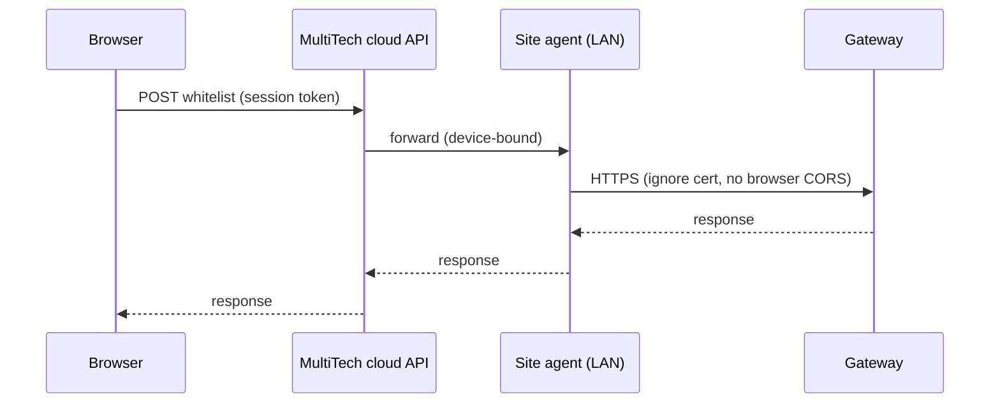

# Architecture options: onboarding without user-visible proxy setup

## The constraint (why “just use Vercel” breaks)

The browser page and the gateway are two different origins:

| Origin | Example |
|--------|---------|
| App | `https://add-sensor-web-app.vercel.app` |
| Gateway | `https://192.168.0.162` |

For add/import, the app must send `POST` / `PUT` with JSON. The browser enforces:

1. **CORS** — gateway must allow the app origin and methods (`POST`, `PUT`). MultiTech gateways typically do not allow a public Vercel origin.
2. **TLS** — self-signed gateway certs cause `ERR_CERT_AUTHORITY_INVALID` unless the user visits the gateway first (fragile).
3. **Private Network Access** — public HTTPS sites calling private IPs (`192.168.x.x`) are increasingly blocked (common on corporate networks).
4. **Reachability** — at the office, the laptop may not route to the same `192.168.x.x` as at home even if the UI “worked” for `GET /api/login` once.

**A server or process on the LAN must talk to the gateway.** The only question is whether the *user* configures that bridge or the *product* hides it.

Vercel/serverless **cannot** reach a customer’s `192.168.x.x` directly. There is no frontend-only fix.

---

## What “abstract everything” really means

| User sees | Behind the scenes |
|-----------|-------------------|
| Gateway IP + credentials | Same |
| One app URL | Local server, site proxy hostname, or cloud relay |
| No “proxy URL” field | Companion service, IT DNS, or tunnel |

---

## Options (comparison)

### Option A — **Bundled local app (recommended near-term)**

**Idea:** Production users never open the Vercel URL for onboarding. They open the app served by `server.mjs` on the same machine (or a site mini-PC).

| | |
|--|--|
| **User enters** | Gateway IP, username, password (only) |
| **Hidden** | `/__gateway__` proxy, cert bypass, CORS |
| **Ship as** | Windows installer / scheduled task (scripts already exist), optional `http://onboarding.local` via mDNS |
| **Works on** | Any network where the PC/phone can reach the gateway on LAN |
| **Fails when** | Phone uses Vercel URL but companion runs on a different PC (unless phone browses to companion host) |

**Pros:** Uses code you already have; no cloud cost; no new security model.  
**Cons:** Not “open Vercel bookmark anywhere”; field device must use the LAN URL of the machine running the service.

**Vercel role:** Marketing, docs, or “download / open local app” landing page.

---

### Option B — **Per-site reverse proxy (IT setup, user still simple)**

**Idea:** IT puts Caddy/Nginx on the LAN with a **trusted hostname** and correct CORS for your Vercel origin (see `DEPLOYMENT_PROXY.md`).

| | |
|--|--|
| **User enters** | `https://gw-site.customer.com` (looks like a gateway address, not a “proxy”) |
| **Hidden** | TLS termination, upstream to `192.168.x.x`, CORS headers |
| **Works on** | Corporate and home if DNS resolves on that network |
| **Fails when** | Gateway only has private IP and no site proxy; varying IPs per user without DNS per gateway |

**Pros:** True Vercel + phone/laptop from one bookmark if DNS and cert are right.  
**Cons:** Per-customer or per-site infrastructure; not zero-config for “any IP the user types.”

---

### Option C — **LAN companion + auto-discovery (hide proxy, hard to make reliable)**

**Idea:** Small service on LAN; Vercel UI discovers it (mDNS, fixed port broadcast, or QR on gateway label).

| | |
|--|--|
| **User enters** | Gateway IP only |
| **Hidden** | Companion URL (e.g. `http://192.168.0.10:3000`) |
| **Works on** | Friendly home Wi‑Fi |
| **Fails when** | Corporate firewall blocks mDNS, multicast, or phone→PC LAN access |

**Pros:** Keeps public hosted UI.  
**Cons:** Discovery is flaky; security review for open LAN endpoints; still doesn’t work if phone can’t reach the companion host.

---

### Option D — **Cloud relay + outbound site agent (best long-term UX, most build)**

**Idea:** Installer on gateway site maintains **outbound** WebSocket to MultiTech cloud. Vercel UI only talks to `https://api.multitech.net/...`; cloud forwards to the agent, agent calls `https://192.168.x.x`.

| | |
|--|--|
| **User enters** | Gateway IP or site code + credentials |
| **Hidden** | Tunnel, relay, cert handling |
| **Works on** | Home, office, remote—if agent is online |
| **Fails when** | Agent not installed or outbound 443 blocked |

**Pros:** Same Vercel URL everywhere; matches “real product” expectations.  
**Cons:** New backend, auth, tenancy, agent lifecycle, security audits.

---

### Option E — **Remote / cloud-connected gateways only**

**Idea:** If the gateway is reachable on a **public hostname** (MultiTech cloud, customer VPN, DDNS), browser or a **fixed** cloud proxy can target that host.

| | |
|--|--|
| **User enters** | Cloud hostname or FQDN |
| **Works on** | Remote gateways with stable DNS |
| **Fails when** | Classic LAN-only `192.168.x.x` |

**Pros:** Simpler than full relay if gateways are already cloud-visible.  
**Cons:** Doesn’t cover offline LAN-only installs by itself.

---

## Decision matrix

| Option | User-visible proxy? | Vercel as main UI | Any user gateway IP | Corporate LAN | Engineering |
|--------|---------------------|-------------------|---------------------|---------------|-------------|
| A Local bundle | No | Optional | Yes | Yes* | Low |
| B Site reverse proxy | No | Yes | Per-site hostname | Yes | Medium (per site) |
| C Auto-discovery | No | Yes | Yes | Poor | Medium–high |
| D Cloud relay | No | Yes | Yes | Yes** | High |
| E Remote gateway only | No | Partial | If public | Varies | Low–medium |

\*PC running the app must reach the gateway.  
\**Requires outbound connectivity from agent; browser still needs to reach cloud.

---

## Recommended path

### Phase 1 (now)

1. **Remove** user-facing “Local proxy URL” and “Proxy access key” from the UI (keep server hardening in `.env.local-server` for IT).
2. **Position** production as: install/start local app → open `http://localhost:3000` or `http://<lan-ip>:3000`.
3. **Vercel** → landing page with link/QR to local app or installer, not primary onboarding surface.

### Phase 2 (customer sites that insist on Vercel URL)

- Document/deploy **Option B** (one trusted hostname per site, CORS allows your Vercel origin).
- Or provide a **standard site appliance image** (Pi/mini PC) that runs Option A + mDNS name.

### Phase 3 (scale / “any network”)

- **Option D** if MultiTech wants a single public URL and LAN gateways without per-site IT proxy work.

---

## What we should not promise

- “Vercel only, user types any `192.168.x.x`, works on home Wi‑Fi and corporate Ethernet” — **not achievable** in the browser without A, B, C, or D above.
- Hiding the proxy field without providing A/B/C/D still leaves users on Vercel with the same CORS/PNA failures.

---

## Next decisions (product)

1. Is the **primary** delivery **installed local app** (A) or **always Vercel** (B/C/D)?
2. Are gateways **always LAN IP**, or is there a **cloud management** hostname/API?
3. Is **phone onboarding** on the same Wi‑Fi required (favors A on `0.0.0.0` or B)?
4. Can **IT** deploy one proxy hostname per site (B)?

Once those are answered, we can implement: UI cleanup (remove proxy fields), Vercel redirect page, and/or spike Option C discovery or Option D agent protocol.
